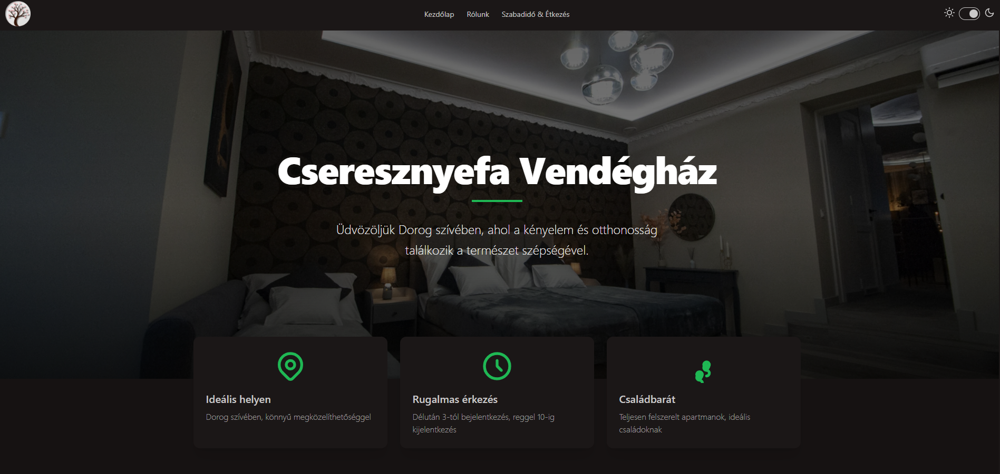
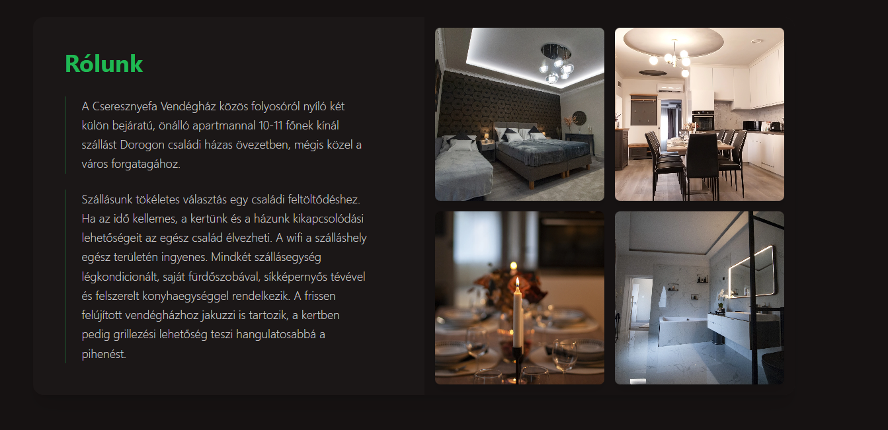
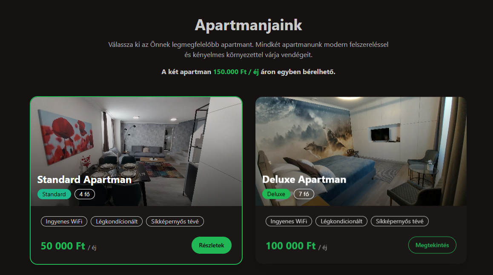
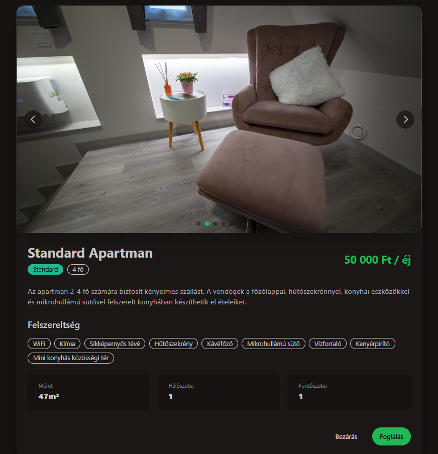
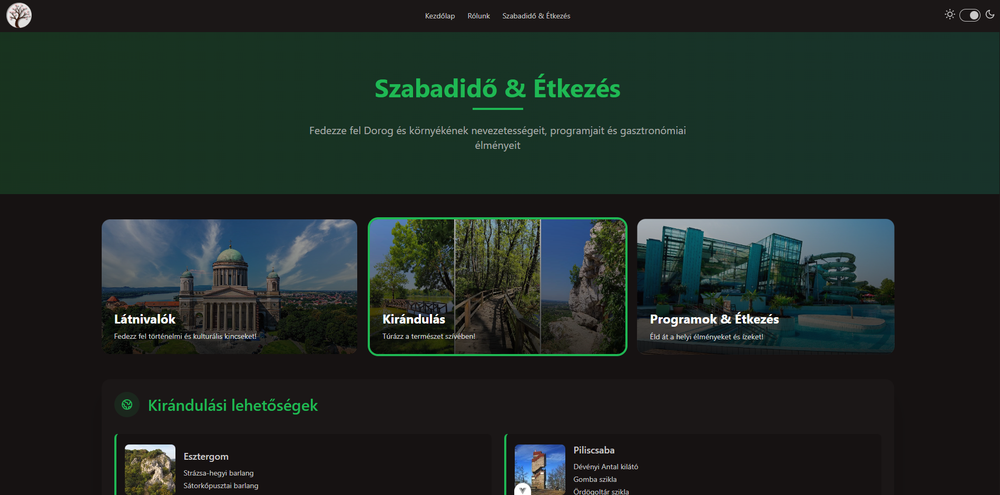

# 🏡 Cseresznyefa Vendégház

[](https://vuejs.org/)
[](https://www.typescriptlang.org/)
[](https://vitejs.dev/)
[](https://tailwindcss.com/)
[](https://daisyui.com/)

A modern, responsive website for Cseresznyefa Vendégház (Guesthouse) built with Vue 3, TypeScript, and Vite. Showcasing beautiful accommodations, local activities, and all amenities available to guests.

🌐 **[View Live Demo](https://cseresznyefa-vendeghaz.vercel.app/)**

## ✨ Features

- 🖼️ **Stunning UI** - Beautiful, responsive design with elegant animations using GSAP
- 🏠 **Apartment Showcase** - Display different apartment types with detailed information
- 🧭 **Activities Explorer** - Browse local attractions, dining options, and activities
- 📱 **Fully Responsive** - Perfect experience on all devices from mobile to desktop
- 🔍 **SEO Friendly** - Optimized for search engines to increase visibility
- 🌙 **Modern UI Components** - Built with Tailwind CSS and DaisyUI for a sleek appearance
- ⚡ **Fast Performance** - Optimized loading times with Vite's build system

## 🛠️ Technologies Used

- **Frontend Framework**: Vue.js 3.5 with Composition API
- **Type Safety**: TypeScript 5.8
- **Build Tool**: Vite 6.3
- **Styling**: Tailwind CSS 4.1 with DaisyUI
- **Routing**: Vue Router 4.5
- **Animations**: GSAP 3.13 and Motion-V
- **Utility**: VueUse Core
- **Code Quality**: Prettier

## 📋 Project Structure

```
src/
├── assets/        # Images and static files
├── components/    # Vue components
│   ├── apartment/ # Apartment-related components
│   ├── icons/     # SVG icons as Vue components
│   ├── layout/    # Layout components (Navbar, Footer)
│   ├── pages/     # Page components
│   └── sections/  # Section components
├── data/          # Data files
├── types/         # TypeScript type definitions
├── App.vue        # Root component
├── main.ts        # Entry point
└── router.ts      # Vue Router configuration
```

## 🚀 Setup and Installation

### Prerequisites

- Node.js (v16 or higher)
- npm or yarn

### Installation Steps

1. Clone the repository

```bash
git clone https://github.com/yourusername/cseresznyefa-vendeghaz.git
cd cseresznyefa-vendeghaz
```

2. Install dependencies

```bash
npm install
# or
yarn
```

3. Start the development server

```bash
npm run dev
# or
yarn dev
```

4. Build for production

```bash
npm run build
# or
yarn build
```

5. Preview production build

```bash
npm run preview
# or
yarn preview
```

## 📸 Screenshots








## 👤 Author

- Name: Raczkó Dávid
- Email: [raczkodavid@gmail.com](mailto:raczkodavid@gmail.com)
